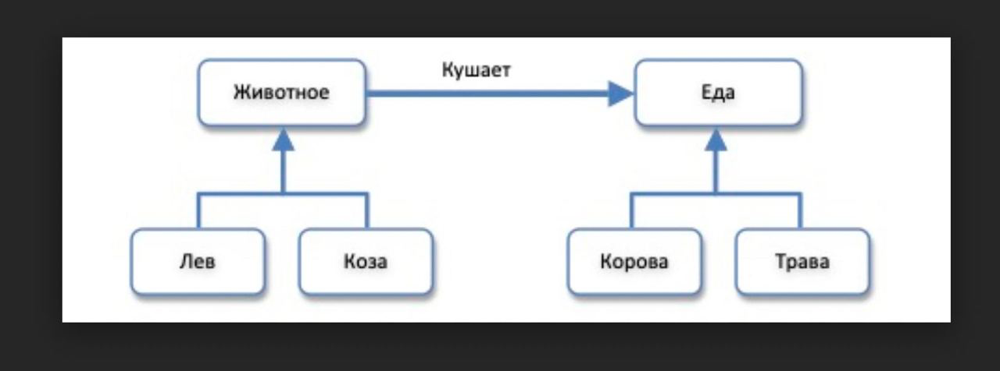
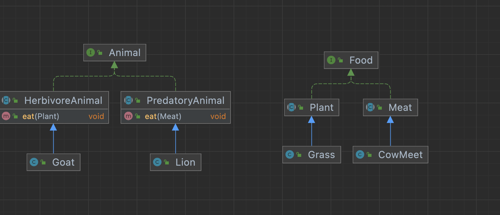

_This repo was created to demonstrate what tasks you can
be asked during tech interview for Java Developer with 2+ years commercial experiance_

Завдання:

У цій моделі є проблеми та конфлікти. Від Вас вимагається:
1. Вкажіть все, що на вашу думку є проблемою і вимагає будь-якого коригування.
2. Створіть альтернативну модель, яка б коректно відображала відносини між зазначеними сутностями.
3. Реалізуйте Вашу модель мовою програмування, якою Ви бажаєте писати код. Необхідно щоб був метод в імплементації моделі: Тварина.їсть(їжу)
  
Коли Ви перероблятимете дизайн, дотримуйтесь наступних умов:
1) Жодна з тварин не може їсти сама себе
2) У написаному коді постарайтеся максимально уникнути IF() перевірок, компенсуючи їх дизайном класів.

**Моя відповідь:**
1) Очевидною проблемою в зазначеній діаграммі є те що ми повинні росщириту архітектуру 
для классів та ввести деякі обмеження, тому що, наприклад, дивлячись на діаграмму, Лев может їсти Траву.
Тому рішення дуже просте - явно видітити можливості тварини(їсть мясо/не їсть мясо) потім більщ конкретно вставновити
їжу яку їсть тварина в методі eat(). 
У випадку, якщо тварина може їсти і мясо, і плантацію - можна додавати новий класс та розширювати можливості тварин.

Відкоригована діаграмма
